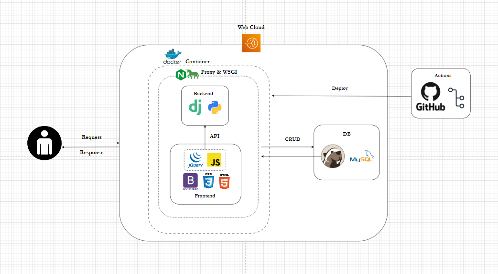

# (산대특)_파이썬 오픈소스를 활용한 머신러닝 빅데이터 분석 SW개발자 양성_육성 2기 

## 주제명 : hi! restaurant
### 조원 : 최련정 / 김찬영 / 황의철 (조장)

---
시스템 아키텍처

----

ERD

ERD_CLOUD : https://www.erdcloud.com/d/N2q98w3RHAweaPFg8
---

와이어프레임

---

Event-Flow

---

페이지시연✔

---

리뷰작성👀

---

마이페이지 내역🚗

---

